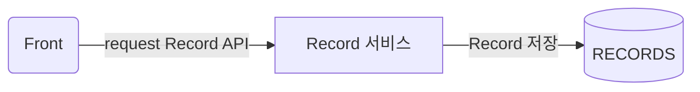
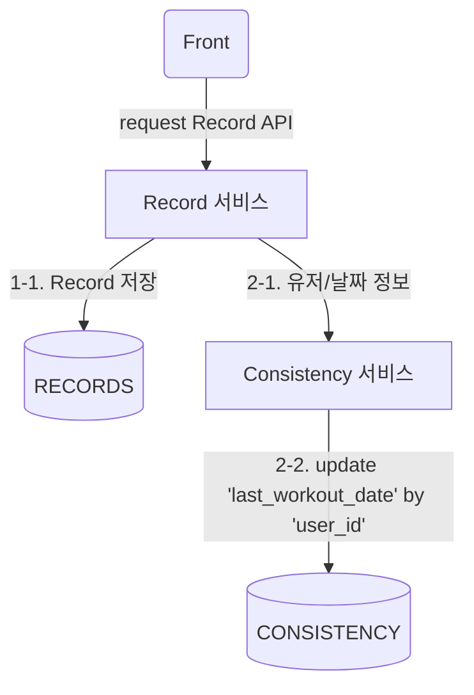
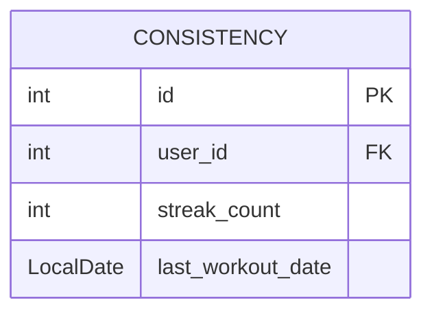
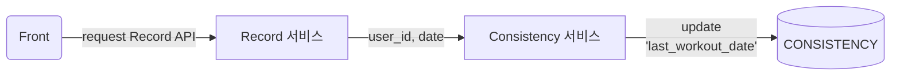
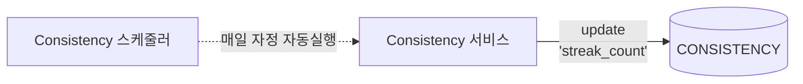
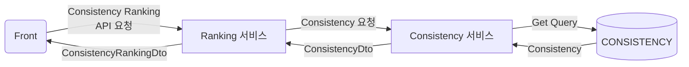

## &#8226; Consistency Logic 추가하기

>  문제사항: 운동 기록(record)을 저장할 때 해당 유저의 `CONSISTENCY` 테이블의 마지막 운동 날짜(`last_workout_date`)를 업데이트 해주어야 함

 

### 1. Record - 기존 로직

 

### 2. Record - 변경 로직

 

## &#8226; Consistency - 전체 로직

> `CONSISTENCY` 테이블 명세 (created_at, updated_at 생략)

 

### 1. 운동 기록 시 마지막 운동 날짜(`last_workout_date`) 업데이트

 

### 2. 매일 자정 `streak_count` 업데이트

<small>`streak_count`업데이트는 오늘 날짜와 `last_workout_date` 를 비교해 진행하며, 모든 유저에 대해 진행합니다.</small>

 

### 3. Consistency Ranking API 호출

<small>Ranking 레이어에서 직접 `CONSISTENCY` 테이블에서 데이터를 조회하지 않고  Consistency 레이어를 이용합니다.</small>
<small>마찬가지로 Consistency 레이어에서는 데이터만 조회해서 전달할 뿐, 실제 랭킹 책정은 Ranking 레이어를 이용합니다.</small>

> 단일 책임 원칙((Single Responsibility Principle) 생각하기
{: .prompt-info}

