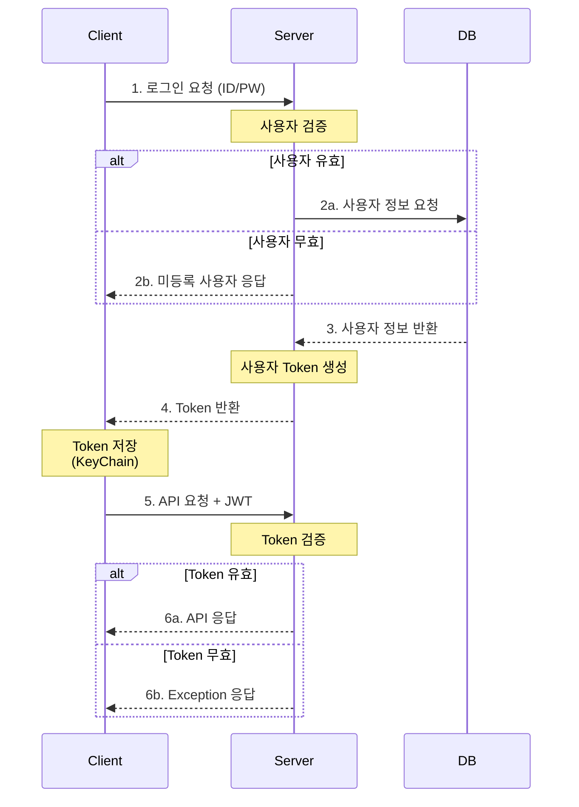

> JWT(JSON Web Token)의 개념과 장점, Java를 통한 구현 코드를 소개합니다.
{: .prompt-info}

기존 프로젝트에서는 유저 인증 방식으로 '세션 기반 인증'을 사용했습니다. 새로운 팀 프로젝트를 하면서 iOS 앱과 통신하기 위해서는 토큰 기반 방식을 선택하게 되었습니다. JWT의 개념과 세션 기반 인증에 비해 토큰 기반 방식의 장단점을 알아보고, Java Spring으로 실제 구현을 어떻게 하는지 공부합니다.

JWT Decoding Site : [https://jwt.io/](https://jwt.io/){: target="_blank" }


<br>

<br>


## **Introduction**

---

JWT(JSON Web Token)는 당사자 간에 정보를 안전하게 전송하기 위한 개방형 표준(RFC 7519)입니다.

클레임 토큰 기반의 인증 방식으로, 클라이언트의 상태를 세션에 저장하는 대신 필요한 정보를 토큰에 저장해서 증명서처럼 사용합니다.

<br>

<br>


## **Structure**

---


_Jwt는 세 부분으로 구성되며, 각 부분은 점(.)으로 구분됩니다._

* **Header (헤더)**
  * **alg**: 서명 생성에 사용된 hash algorithm을 지정
  * **typ**: Token type을 명시
* **Payload (페이로드)**
  * 전달할 **실제 데이터가 담기는 부분**입니다.
  * 데이터는 key-value pair 형식으로 담기며, JWT에서는 **클레임(claim)**이라고 부릅니다.

* **Signature (서명)**
  * Header와 Payload를 **비밀키로 서명한 부분**입니다.
  * 토큰의 **위변조 여부를 검증**하는데 사용됩니다.

<br>

<br>


## **Token vs Session: Pros and Cons**

---

### Pros

* 서버에 상태 저장이 불필요하므로 **서버 확장성**이 우수합니다.
* 서버에 세션을 저장하지 않으므로 **서버 메모리 관리가 효율적**입니다.
* REST API 기반의 다양한 **클라이언트 플랫폼 지원**이 용이합니다.

### Cons

* 토큰 자체에 정보를 담고 있어 전송 시 **Network Overhead**가 발생할 수 있습니다.
* 토큰이 탈취된 경우 만료 시간까지 강제 무효화가 어렵습니다.
* Base64로 인코딩된 **Payload Claims가 디코딩으로 노출**될 수 있습니다.

> *서버의 확장성과 유지보수성, 클라이언트와의 상호운용성 측면에서 장점이 있으나, 보안상 주의가 필요합니다.* <br>
> *이러한 보안 이슈를 보완하기 위해 Spring Security와 연동하여 사용하는 것이 일반적입니다.* <br>
> *(이번에는 단순히 Jwt 클래스로만 사용합니다)*

<br>

<br>


## **JWT Implement**

---

### 1. jjwt 라이브러리 의존성 추가 (gradle)

```groovy
dependencies {
	implementation 'io.jsonwebtoken:jjwt-api:0.11.5'
	runtimeOnly 'io.jsonwebtoken:jjwt-impl:0.11.5'
	runtimeOnly 'io.jsonwebtoken:jjwt-jackson:0.11.5'
}
```


### 2. Jwt Token Provider 클래스 설계

```java
@Service
public class JwtTokenProvider {
	
    @Value("${jwt.secret}")
    private String JWT_SECRET;
    private Key key;
	
    @Value("${jwt.expiration}")
    private long JWT_EXPIRATION_MS;


    // Key 생성 - bean 생성 시 자동 호출
    @PostConstruct
    protected void init() {
        byte[] keyBytes = Decoders.BASE64.decode(JWT_SECRET);
        key = Keys.hmacShaKeyFor(keyBytes);
    }

    // TODO: JWT 생성하기
    // TODO: JWT 유효성 검증
    // TODO: JWT 가져오기
}
```

* Jwt Token Provider 클래스는 JWT와 관련된 작업을 총괄적으로 처리하는 클래스입니다.
* Secret key, Expiration time은 보안 및 관리 용이를 위해 `application.yml` 파일에 별도 관리합니다.


###  3. JWT 생성하기

```java
public String generateToken(AccessToken tokenRequest) {
    Date now = new Date();
    Date exp = new Date(now.getTime() + JWT_EXPIRATION_MS);

    return Jwts.builder()
            .setHeaderParam("typ", "JWT")
            .claim("deviceId", tokenRequest.getDeviceId())
            .claim("userId", tokenRequest.getUserId())
            .claim("name", tokenRequest.getName())
            .setIssuedAt(now)
            .setExpiration(exp)
            .signWith(key, SignatureAlgorithm.HS256)
            .compact();
}
```

* **AccessToken(parameter)**는 토큰에 담을 데이터들을 AcessToken DTO로 캡슐화하여 전달합니다.
* **claim()**: 토큰에 데이터(claim)을 담습니다.
* 토큰 생성시간, 만료시간, KEY를 설정 후 반환합니다.


### 4. JWT 가져오기 (Parsing & Decoding)

```java
public Claims getTokenClaims(String token) {
    return Jwts.parserBuilder()
            .setSigningKey(key)
            .build()
            .parseClaimsJws(token)
            .getBody();
}
```

* **parserBuilder()**: 인자로 들어오는 토큰 파싱을 진행합니다.
* **setSigningKey()**: Secret Key로 토큰을 검증(유효성 및 변형 여부)합니다.
* **getBody()**: 디코딩된 데이터를 `Claim` 타입으로 가져옵니다. 반환 타입은 `Claims`로 설정합니다.


### 5. JWT 유효성검증

```java
public boolean validateToken(String token) {

    try { // Token Parsing을 통한 검증
        Jwts.parserBuilder()
        .setSigningKey(key)
        .build()
        .parseClaimsJws(token);
        return true;
    } catch (SecurityException | MalformedJwtException e) {
        log.error("잘못된 JWT 서명입니다.");
    } catch (ExpiredJwtException e) {
        log.error("만료된 JWT 토큰입니다.");
    } catch (UnsupportedJwtException e) {
        log.error("지원되지 않는 JWT 토큰입니다.");
    } catch (IllegalArgumentException e) {
        log.error("JWT 토큰이 잘못되었습니다.");
    }

    return false;
}
```

* 'JWT 가져오기' 메서드와 크게 다르지 않습니다. **토큰 만료 여부 검증을 주 목적**으로 하는 메서드입니다.
* 토큰 유효성 여부에 따라 `true/false`를 반환하도록 설계했습니다.

<br>

<br>


## Overall Flow

---



1. 사용자가 로그인을 하면 Server에서 사용자 검증 후, 데이터베이스에서 받아온 사용자 정보로 JWT를 생성해서 반환합니다.
   * 등록된 사용자가 아니라면 Client에 회원가입을 요청하는 응답을 보냅니다.
2. Client는 반환된 JWT를 저장합니다.
3. API 요청시 Request header에 JWT를 포함해서 Server에 요청을 보냅니다.
4. Server는 JWT 유효성 검증에 따라 API 데이터 혹은 약속된 예외처리로 Client에 응답합니다.
