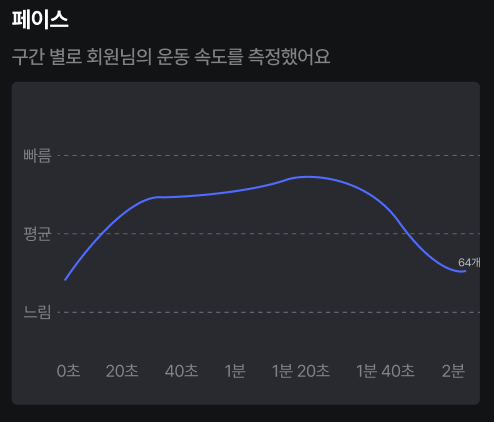
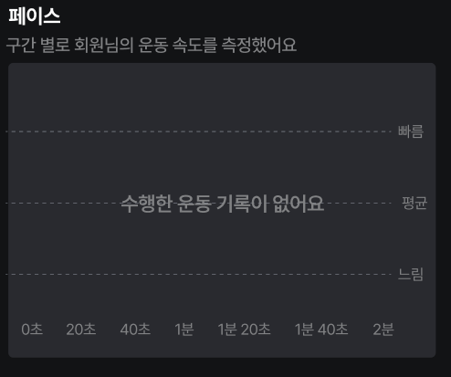
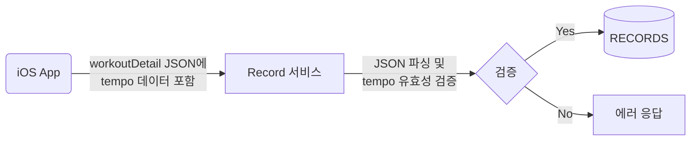
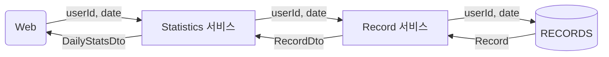

 

## 1. Daily Stats Web UI 예시

---

{: width="300px" style="border-radius:8px;"}
_해당 날짜의 운동 페이스를 그래프로 나타냅니다._

{: width="300px" style="border-radius:8px;"}
_해당 날짜에 운동을 하지 않은 경우 UI 디자인입니다._

 

## 2. Daily Stats 전체 로직 설계

---

### 1) `workout_detail`에  `tempo` 속성으로 기록

- **`tempo`** 속성
  - 타입: `ArrayList<Double>`
  - Null이 아닐 경우 유효성 검사 필요 (Nullable)

 

### 2) Daily Stats API 구현

 
- Statistics 서비스 레이어에서 Record 데이터에 있는 `workoutDetail - tempo`를 추출해서 `dto` 에 담습니다.
  - **CASE1:** 해당 날짜에 운동을 안한 경우 or 운동은 했지만 `tempo` 는 기록하지 않은 경우
    - **RETURN:** 빈 배열 `[ ]` 
  - **CASE2:** 해당 날짜에 운동을 하고 `tempo` 도 기록된 경우
    - **RETURN:** [1.34, 2.43, 3.42, 5.1, ... ]
  - **CASE3:** `tempo` 가 잘못된 형식으로 저장된 경우 {Exception 발생}
    - **RETURN:** error code & error message
    - 하지만 기록할 때 유효성 검사를 하므로 이런 경우는 없어야합니다.

